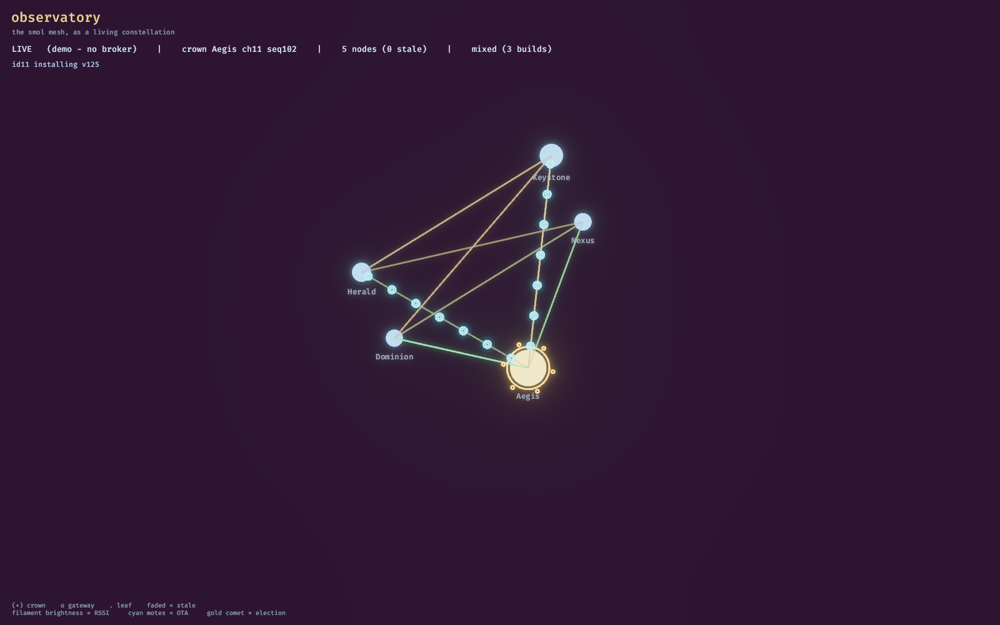

# observatory — the smol mesh as a living fantasy constellation



The **showpiece** visualizer of the smol ESP-NOW mesh (issue #159): a Bevy scene that
renders the live fleet as a glowing, drifting constellation. Its sibling
[`meshscope`](../../meshscope) (#158) is the precise egui *instrument*; observatory is
for the wall display and the Hackaday hero clip.

Both read the **same** world model — the shared [`mesh-model`](../mesh-model) crate — so
a bug fixed in the model fixes both faces, and a new telemetry field lights up both.

## What you see

| Mesh reality | On screen |
|---|---|
| A node is alive | a glowing orb, breathing gently; force-directed layout drifts the fleet |
| The crown (gateway/election owner) | a gold halo with slow rotating accents; pulled to the centre |
| A node hasn't been heard in a while | its orb dims to a ghost and fades (freshness = truth) |
| Per-peer RSSI (from `PEERS`) | luminous **filaments**; brighter = stronger link; they shimmer and fade with age |
| An **election** (`smol/mesh/channel` owner change) | a gold **comet** arcs from the old crown to the new one |
| An **OTA** transfer (`ota/state` `in_progress`) | a **cyan particle stream** flows crown → leaf, a mana-burst on completion |
| A **channel hop** (`MC` channel change) | the whole field's **colour temperature shifts** |
| Broker / crown / build uniformity / stale count | the HUD status bar |

Every animation is triggered by a real model-state transition — nothing is faked in
the renderer. (Listener-only: observatory never publishes to `smol/*`.)

## Run

```sh
# No broker needed — a scripted synthetic mesh that exercises every effect on a loop:
observatory --demo

# Live, against the fleet broker (env or a local .env — see .env.example):
SMOL_MQTT_HOST=10.0.6.108 SMOL_MQTT_USER=… SMOL_MQTT_PASS=… observatory

# Headless model check (no display, for CI / the build host):
observatory --selftest

# Save one rendered frame (needs a display; on a headless host use Xvfb):
xvfb-run -a observatory --demo --screenshot capture.png --at 12
```

Credentials come **only** from the environment (`SMOL_MQTT_HOST` / `SMOL_MQTT_PORT` /
`SMOL_MQTT_USER` / `SMOL_MQTT_PASS`) or a gitignored `.env`. Never committed.

## Build

Heavy (Bevy) — build on the **familiar** host (24 cores), not katana:

```sh
cargo build --release -p observatory      # from rust/viz/
```

Bevy is configured `default-features = false` with a curated 2D + bloom + UI feature
set: **no audio** (a viz tool needs none; also drops the `libasound2` build dep), no
PBR/glTF/scene. Runs on any host with a Vulkan driver (incl. software `lavapipe` for
headless capture).

## HA dashboard parity

Per the [mesh-visualizers design spec](../../../docs/superpowers/specs/2026-07-18-mesh-visualizers-design.md),
observatory and the Home Assistant "Control Room" dashboard stay in **feature parity,
both directions**. The `mesh-model` fold is the single source of derivation truth:

- **Viz → HA**: every signal observatory shows (crown/channel, per-peer RSSI edges,
  elections, OTA progress, build uniformity, stale aging) must be surfaceable in HA.
  Where HA can't render a concept natively (an RSSI *graph*), `mesh-model` grows an
  opt-in `--publish` bridge that republishes derived state to retained `smol/derived/*`
  topics for HA to consume (derived topics only — **never** `smol/<id>/*` commands).
- **HA → viz**: anything HA shows (luna's DIAG discovery sensors, on-glass BATT/GRID)
  comes from the same source topics, so nothing is HA-exclusive.
- Shared vocabulary (node names, build labels, "stale"/"weak-link" thresholds) is
  defined once in `mesh-model` and mirrored into the HA package.

The `--publish` bridge is the contract; it is **not yet implemented** (v1 is
listener-only). Parity is tracked on the epic (#158/#159): *added to viz → add to HA*.

## Status / roadmap

- **v1 (this crate):** demo + live constellation with all effects; headless selftest.
- **Follow-up:** converge `meshscope` into this `rust/viz/` workspace so both depend on
  the shared `mesh-model` (it is currently a verbatim lift of meshscope's core); the
  `--publish` HA bridge; a `wasm32` target so observatory (and meshscope) can embed in
  the project site as a *live* fleet dashboard.
